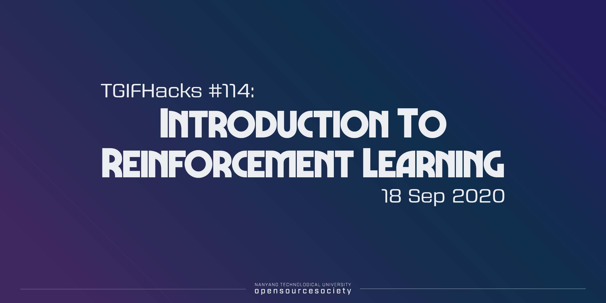

# NTUOSS Reinforcement Learning Workshop
By [Jay Gupta](https://github.com/guptajay) for [NTU Open Source Society](https://github.com/ntuoss)

***Disclaimer*** The slides ([PDF](Slides.pdf), [Google Slides](https://docs.google.com/presentation/d/1wzvwmF85nGoy6s3Yb7ACaG5-ZNORvmXqK2By2dx7UAA/edit?usp=sharing)) and Codes in this repository are only meant to serve as a reference for the attendees of the workshop. It does not cover all the concepts or implementation details discussed during the actual workshop.

### Workshop Details:

**When:** Friday, 18 September 2020. 6:30 PM - 8:30 PM 
**Where:** Microsoft Teams (due to COVID-19 safe distancing measures) 
**Organiser:** NTU Open Source Society

### Questions?

Raise your hand at any time with the 'Raise Hand' feature in Microsoft Teams during the workshop or shoot me an [e-mail](mailto:jay002@e.ntu.edu.sg) later.

### Errors?

If you find any mistake (typo or anything else), please post an issue! Thanks!

## Prerequisites

Before you start the workshop, make sure you have these:

+ Python 3 installed in your system
+ A code editor such as Visual Studio Code

>That's all you need!
